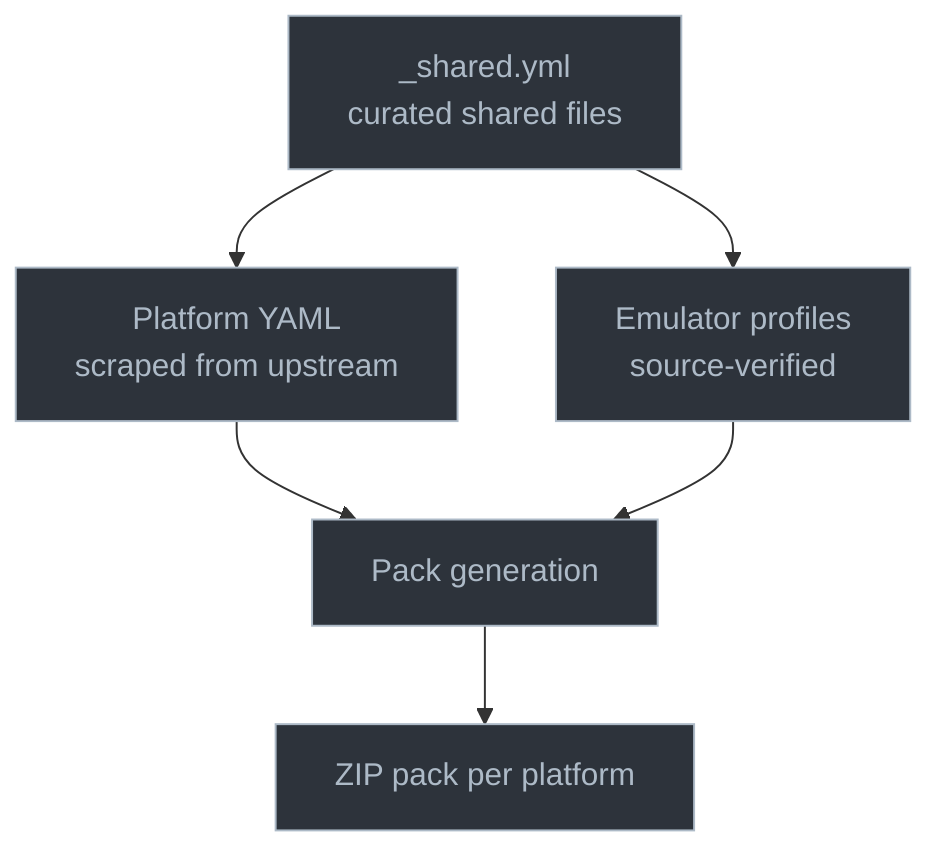
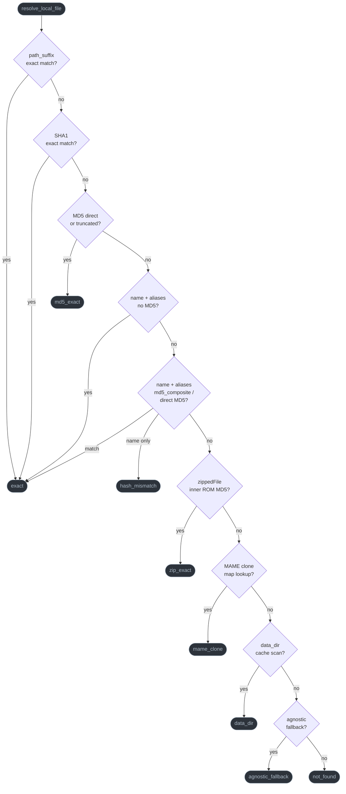

# Architecture - RetroBIOS

## Directory structure

```
bios/                    BIOS and firmware files, organized by Manufacturer/Console/
  Manufacturer/Console/  canonical files (one per unique content)
  .variants/             alternate versions (different hash, same purpose)
emulators/               one YAML profile per core/engine
platforms/               one YAML config per platform (scraped from upstream)
  _shared.yml            shared file groups across platforms
  _registry.yml          platform metadata (logos, scrapers, status, install config)
  _data_dirs.yml         data directory definitions (Dolphin Sys, PPSSPP...)
  targets/               hardware target configs + _overrides.yml
scripts/                 all tooling (Python, pyyaml only dependency)
  scraper/               upstream scrapers (libretro, batocera, recalbox...)
  scraper/targets/       hardware target scrapers (retroarch, batocera, emudeck, retropie)
  exporter/              native format exporters (batocera, recalbox, emudeck...)
install/                 JSON install manifests per platform
  targets/               JSON target manifests per platform (cores per architecture)
data/                    cached data directories (not BIOS, fetched at build)
schemas/                 JSON schemas for validation
tests/                   E2E test suite with synthetic fixtures
_mame_clones.json        MAME parent/clone set mappings
dist/                    generated packs (gitignored)
.cache/                  hash cache and large file downloads (gitignored)
```

## Data flow

```
Upstream sources          Scrapers parse       generate_db.py scans
  System.dat (libretro)   + fetch versions     bios/ on disk
  batocera-systems                             builds database.json
  es_bios.xml (recalbox)                       (SHA1 primary key,
  core-info .info files                         indexes: by_md5, by_name,
  FirmwareDatabase.cs                           by_crc32, by_sha256, by_path_suffix)
  MAME/FBNeo source

emulators/*.yml          verify.py checks      generate_pack.py resolves
  source-verified         platform-native       files by hash, builds ZIP
  from code               verification          packs per platform

truth.py generates       diff_truth.py         export_native.py
  ground truth from       compares truth vs     exports to native formats
  emulator profiles       scraped platform      (DAT, XML, JSON, Bash)
```

Pipeline runs all steps in sequence: DB, data dirs, MAME/FBNeo hashes,
verify, packs, install manifests, target manifests, consistency check,
pack integrity, README, site. See [tools](tools.md) for the full pipeline reference.


## Three layers of data

| Layer | Source | Role |
|-------|--------|------|
| Platform YAML | Scraped from upstream | What the platform declares it needs |
| `_shared.yml` | Curated | Shared files across platforms, reflects actual behavior |
| Emulator profiles | Source-verified | What the code actually loads. Used for cross-reference and gap detection |

The pack combines platform baseline (layer 1) with core requirements (layer 3).
Neither too much (no files from unused cores) nor too few (no missing files for active cores).

The emulator's source code serves as ground truth for what files are needed,
what names they use, and what validation the emulator performs. Platform YAML
configs are scraped from upstream and are generally accurate, though they can
occasionally have gaps or stale entries. The emulator profiles complement the
platform data by documenting what the code actually loads. When the two disagree,
the profile takes precedence for pack generation: files the code needs are included
even if the platform does not declare them. Files the platform declares but no
profile references are kept as well (flagged during cross-reference), since the
upstream may cover cases not yet profiled.



## Pack grouping

Platforms that produce identical packs are grouped automatically.
RetroArch and Lakka share the same files and `base_destination` (`system/`),
so they produce one combined pack (`RetroArch_Lakka_BIOS_Pack.zip`).
RetroPie uses `BIOS/` as base path, so it gets a separate pack.
With `--target`, the fingerprint includes target cores so platforms
with different hardware filters get separate packs.

## Storage tiers

| Tier | Meaning |
|------|---------|
| `embedded` (default) | file is in the `bios/` directory, included in packs |
| `external` | file has a `source_url`, downloaded at pack build time |
| `user_provided` | user must provide the file (instructions included in pack) |

## Verification severity

How missing or mismatched files are reported:

| Mode | required + missing | optional + missing | hash mismatch |
|------|-------------------|-------------------|--------------|
| existence | WARNING | INFO | N/A |
| md5 | CRITICAL | WARNING | UNTESTED |

Files with `hle_fallback: true` are downgraded to INFO when missing
(the emulator has a software fallback).

## Discrepancy detection

When a file passes platform verification (MD5 match) but fails
emulator-level validation (wrong CRC32, wrong size), a DISCREPANCY is reported.
The pack generator searches the repo for a variant that satisfies both.
If none exists, the platform version is kept.

## Security

- `safe_extract_zip()` prevents zip-slip path traversal attacks
- `deterministic_zip` rebuilds MAME ZIPs so same ROMs always produce the same hash
- `crypto_verify.py` and `sect233r1.py` verify 3DS RSA-2048 signatures and AES-128-CBC integrity
- ZIP inner ROM verification via `checkInsideZip()` replicates Batocera's behavior
- `md5_composite()` replicates Recalbox's composite ZIP hash

## Edge cases

| Case | Handling |
|------|---------|
| Batocera truncated MD5 (29 chars) | prefix match in resolution |
| `zippedFile` entries | MD5 is of the ROM inside the ZIP, not the ZIP itself |
| Regional variants (same filename) | `by_path_suffix` index disambiguates |
| MAME BIOS ZIPs | `contents` field documents inner structure |
| RPG Maker/ScummVM | excluded from dedup (NODEDUP) to preserve directory structure |
| `strip_components` in data dirs | flattens cache prefix to match expected path |
| case-insensitive dedup | prevents `font.rom` + `FONT.ROM` conflicts on Windows/macOS |
| frozen snapshot cores | `.info` may reflect current version while code is pinned to an old one. Only the frozen source at the pinned tag is reliable (e.g. desmume2015, mame2003) |

### File resolution chain

`resolve_local_file` in `common.py` tries each strategy in order, returning the
first match. Used by both `verify.py` and `generate_pack.py`.



## Platform inheritance

Platform configs support `inherits:` to share definitions.
Lakka inherits from RetroArch, RetroPie inherits from RetroArch with `base_destination: BIOS`.
`overrides:` allows child platforms to modify specific systems from the parent.

Core resolution (`resolve_platform_cores`) uses three strategies:

- `cores: all_libretro` - include all profiles with `libretro` in their type
- `cores: [list]` - include only named profiles
- `cores:` absent - fallback to system ID intersection between platform and profiles

## Hardware target filtering

`--target TARGET` filters packs and verification by hardware (e.g. `switch`, `rpi4`, `x86_64`).
Target configs are in `platforms/targets/`. Overrides in `_overrides.yml` add aliases and
adjust core lists per target. `filter_systems_by_target` excludes systems whose cores are
not available on the target. Without `--target`, all systems are included.

## MAME clone map

`_mame_clones.json` at repo root maps MAME clone ROM names to their canonical parent.
When a clone ZIP was deduplicated, `resolve_local_file` uses this map to find the canonical file.

## Install manifests

`generate_pack.py --manifest` produces JSON manifests in `install/` for each platform.
These contain file lists with SHA1 hashes, platform detection config, and standalone copy
instructions. `install/targets/` contains per-architecture core availability.
The cross-platform installer (`install.py`) uses these manifests to auto-detect the
user's platform, filter files by hardware target, and download with SHA1 verification.

## Tests

5 test files, 259 tests total:

| File | Tests | Coverage |
|------|-------|----------|
| `test_e2e.py` | 196 | file resolution, verification, severity, cross-reference, aliases, inheritance, shared groups, data dirs, storage tiers, HLE, launchers, platform grouping, core resolution, target filtering, truth/diff, exporters |
| `test_pack_integrity.py` | 8 | extract ZIP packs to disk, verify paths + hashes per platform's native mode |
| `test_mame_parser.py` | 22 | BIOS root set detection, ROM block parsing, macro expansion |
| `test_fbneo_parser.py` | 16 | BIOS set detection, ROM info parsing |
| `test_hash_merge.py` | 17 | MAME/FBNeo YAML merge, diff detection |

```bash
python -m unittest tests.test_e2e -v
```

## CI workflows

| Workflow | File | Trigger | Role |
|----------|------|---------|------|
| Build & Release | `build.yml` | push to main (bios/, platforms/) + manual | restore large files, build packs, create GitHub release |
| Deploy Site | `deploy-site.yml` | push to main (platforms, emulators, wiki, scripts) + manual | generate site, build with MkDocs, deploy to GitHub Pages |
| PR Validation | `validate.yml` | pull request on `bios/`/`platforms/` | validate BIOS hashes, schema check, run tests, auto-label PR |
| Weekly Sync | `watch.yml` | cron (Monday 6 AM UTC) + manual | scrape upstream sources, detect changes, create update PR |

Build workflow has a 7-day rate limit between releases and keeps the 3 most recent.

## License

See `LICENSE` at repo root. Files are provided for personal backup and archival.

